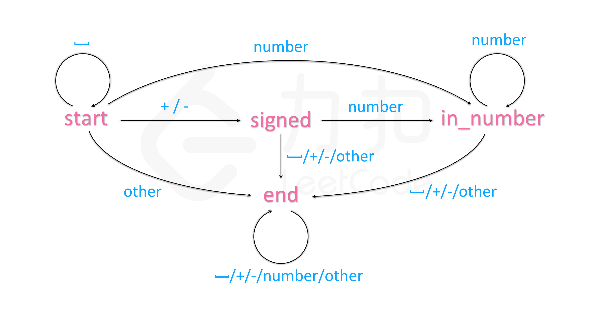

## 字符串

知识点要求:

* 实现一个字符集, 只包含a~z这26个英文字母的 Trie 树.
* 实现朴素的字符串匹配算法

朴素匹配算法: Brute Force, BF算法, 即暴力匹配算法. 

主串, 模式串.

朴素算法: 我们在主串中, 检查起始位置分别是: 0, 1, 2, n-m 且长度为m的n-m+1个子串. 看是否有跟模式串匹配的

时间复杂度: O(n*m)

Trie 树: 字典树. 它是一种树形结构. 它是一种专门处理字符串匹配的数据结构. 用来解决在一组字符串集合中快速查找某个字符串的问题.

Trie 树的本质, 就是利用字符串之间的公共前缀, 将重复的前缀合并在一起.

Trie 树的根节点不存储任何信息. 每个节点表示字符串中的一个字符.

Trie 树两个操作: 

* 将一个字符串添加到Trie树
* 在Trie树中查找一个字符串

## LeetCode相关习题

* 344. [反转字符串](https://leetcode-cn.com/problems/reverse-string/)
    
难度: 简单

* 151. [翻转字符串里的单词](https://leetcode-cn.com/problems/reverse-words-in-a-string/)
    
难度: 中等

* 8. [字符串转换整数 (atoi)](https://leetcode-cn.com/problems/string-to-integer-atoi/)
    
难度: 中等
    

| 状态 | 空字符 | +/- | number | other |
| ---  | --- | --- | --- | --- |
| start | start | signed | in_number | end |
| signed | end | end | in_number | end |
| in_number | end | end | in_number | end |
| end | end | end | end | end|

状态机共有: start, signed, isNumber, end 四种状态.

而遍历字符时, 每一个字符都会驱动当前状态到另一个状态. 根据状态来编程.

第一次听说有限状态机这种编程思想. 

扩展: DFA的题目

* 393. [UTF-8 编码验证](https://leetcode-cn.com/problems/utf-8-validation/)
* 65. [有效数字](https://leetcode-cn.com/problems/valid-number/)
* [剑指 Offer 64. 求1+2+…+n](https://leetcode-cn.com/problems/qiu-12n-lcof/)

